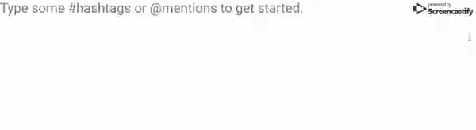

# react-native-twitter-textview
A `<Text/>` component for [React Native](https://facebook.github.io/react-native) and [React Native Web](https://github.com/necolas/react-native-web) that automatically detects **#hashtags** and **@mentions**.

<p align="center">
  
</p>

## 🚀 Getting Started
Using [`npm`](https://www.npmjs.com/package/react-native-twitter-textview):

```
npm install --save react-native-twitter-textview
```

Using [`yarn`](https://www.npmjs.com/package/react-native-twitter-textview):

```
yarn add react-native-twitter-textview
```

## ✍️ Usage
It's super easy; just replace your React Native [`<Text />`](https://facebook.github.io/react-native/docs/text.html) component with a [`<TwitterTextView />`](./TwitterText/src/components/TwitterTextView), and there you go!

```javascript
const App = ({}) => {
  const [value, onChangeText] = useState('')
  return (
    <View
      style={StyleSheet.absoluteFill}
    >
      <TextInput
        onChangeText={onChangeText}
        value={value}
        placeholder="Type some #hashtags or @mentions to get started."
        multiline
        numberOfLines={4}
      />
      <TwitterTextView
        style={styles.twitterTextView}
        hashtagStyle={styles.hashtagStyle}
        mentionStyle={styles.mentionStyle}
      >
        {value}
      </TwitterTextView>
    </View>
  );
}
```

## 📋 Props
-----
Prop                  | Type     | Default                   | Required | Description
--------------------- | -------- | ------------------------- | -------- | -----------
children|string|''|No|
extractHashtags|bool|true|No|
onPressHashtag|func|(e, hashtag) => null|No|
hashtagStyle|shape[object Object]|styles.linkStyle|No|
extractMentions|bool|true|No|
onPressMention|func|(e, hashtag) => null|No|
mentionStyle|shape[object Object]|styles.linkStyle|No|

## ✌️ License
[MIT](https://opensource.org/licenses/MIT)
